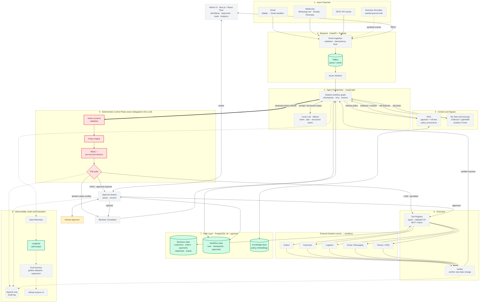
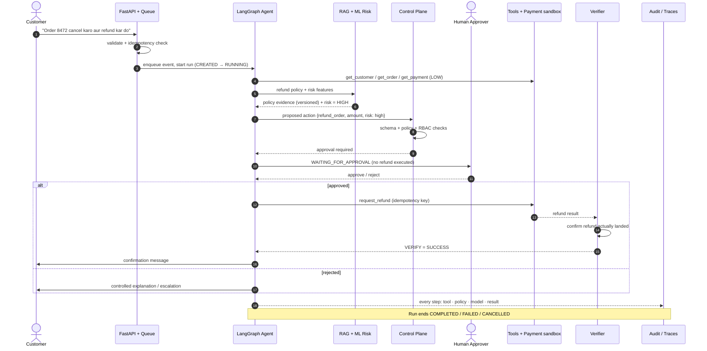
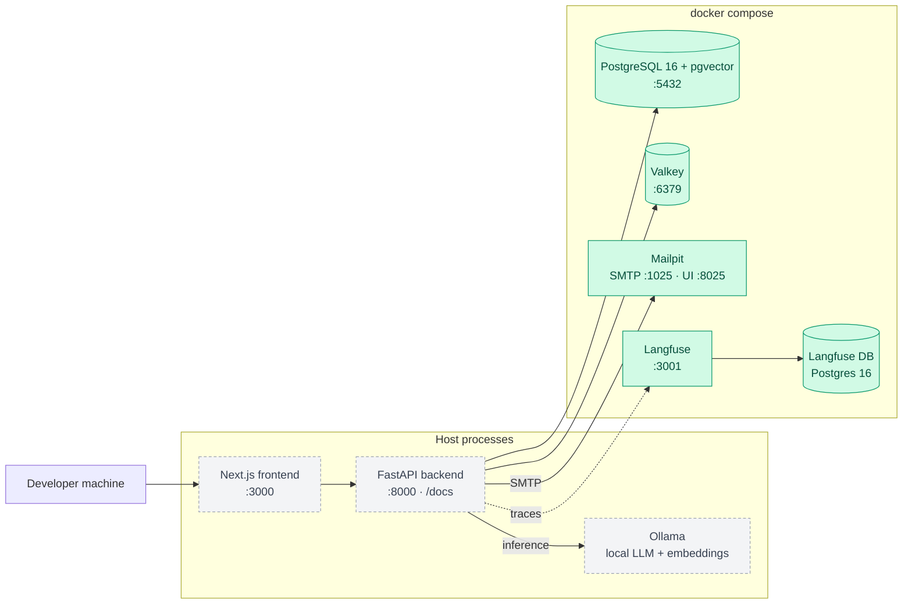

# OpsWingman

> **Intelligent Operations for Modern Businesses**  
> A local-first, agentic operations platform designed to execute repeatable business workflows across email, orders, payments, logistics, knowledge, and internal systems — while keeping policy, permissions, verification, and auditability strictly outside the LLM.

---

## 🎯 Project Overview

OpsWingman provides a reliable operations execution layer for customer and order workflows (initially targeting Indian SMB operations). Rather than acting as an unrestricted chatbot or conversational copilot, OpsWingman treats AI models as reasoning and drafting components governed by **deterministic application code**, **formal authorization boundaries**, and **human-in-the-loop review** for sensitive actions.

### 🛡️ Core Architectural Principle
> **The LLM must NOT control authorization, permissions, secrets, database truth, or final approval of sensitive actions.**  
> All security policies, financial executions, state updates, and external API requests are validated and guarded by deterministic software boundaries.

---

## 📊 Current Status: Phase 4 — ML Risk Scoring, Verification & Resilience

The repository is currently at **Phase 4 (ML Risk Scoring)**.

- [x] Monorepo directory structure established
- [x] Docker & local development environment configured
- [x] Baseline dependencies & packaging defined (FastAPI / Next.js)
- [x] Foundation architecture documentation & coding conventions documented
- [x] Unit test harness initialized
- [x] *Phase 1: Operational API & Business Simulator (Next milestone)*
- [x] *Phase 2: Workflow Engine, State & Tool Registry*
- [x] *Phase 3: RAG, Policy Engine & Human Approval Queue*
- [ ] *Phase 4: ML Risk Scoring, Verification & Resilience*
- [ ] *Phase 5: Evaluation Harness, Benchmark Datasets & E2E Verification*

---

## 🏗️ Repository Structure

```
opswingman/
├── frontend/                  # Next.js 14+ frontend with TypeScript & React Flow
├── backend/                   # Python 3.12+ FastAPI backend service
│   ├── api/                   # REST API routes & controllers
│   ├── agents/                # LangGraph stateful agent definitions
│   ├── workflows/             # Business workflow definitions & state transitions
│   ├── tools/                 # Typed tool registry & permission perimeter
│   ├── policies/              # Deterministic business rules & decision engines
│   ├── rag/                   # Knowledge retrieval, ingestion, & citation provenance
│   ├── ml/                    # Risk scoring, anomaly detection, & versioned models
│   ├── approvals/             # Human-in-the-loop approval state management
│   ├── audit/                 # Append-only audit logging & trace provenance
│   ├── security/              # Auth, input sanitization, & secret governance
│   └── evaluation/            # In-code evaluation probes & assertion monitors
├── simulator/                 # Synthetic business event & ground-truth data generator
├── workers/                   # Async task workers & background queue consumers
├── database/                  # Database models and Alembic migrations
│   ├── models/                # SQLAlchemy operational models
│   └── migrations/            # Alembic migration scripts
├── integrations/              # External service adapters & sandbox clients
│   ├── mock/                  # High-fidelity mock services
│   ├── gmail/                 # Email integration
│   ├── razorpay/              # Payment gateway integration
│   ├── shopify/               # Order management integration
│   └── whatsapp/              # Messaging channel integration
├── evals/                     # Evaluation datasets, evaluators, & regression suites
│   ├── datasets/              # Golden benchmark scenarios & ground truth
│   ├── evaluators/            # Task-specific scoring evaluators
│   ├── regression/            # Automated regression suites
│   └── reports/               # Evaluation run outputs & metric reports
├── tests/                     # Multi-tier test suite
│   ├── unit/                  # Unit tests for deterministic logic
│   ├── integration/           # Integration tests for databases & tools
│   ├── e2e/                   # Full workflow end-to-end tests
│   ├── security/              # Security perimeter & prompt injection tests
│   └── resilience/            # Failure recovery & chaos tests
├── docs/                      # Project documentation & operational guides
├── architecture/              # System architecture specifications & diagrams
├── scripts/                   # Developer automation & lifecycle scripts
├── docker/                    # Dockerfiles & container initialization scripts
├── docker-compose.yml         # Local infrastructure orchestration
└── .env.example               # Environment variables template
```
## 🏛️ System Architecture

> **Core rule:** the LLM *proposes*, deterministic code *decides*. Authorization, policy, execution, verification and audit all live outside the model.

**Legend:** 🟩 green = provisioned in Phase 0 (Docker infra) · ⬜ grey dashed = planned (Phases 1–7)



### Request lifecycle: high-value refund (Scenario A2)



### Local infrastructure (Docker Compose)




---

## 🛠️ Technology Stack

| Layer | Technologies |
| :--- | :--- |
| **Backend** | Python 3.12, FastAPI, Pydantic v2, SQLAlchemy 2.0, Alembic |
| **Frontend** | Next.js, React, TypeScript, Tailwind CSS, React Flow |
| **Database** | PostgreSQL 16 + `pgvector` extension |
| **Cache & Queue** | Valkey (Redis-compatible) |
| **Local Services** | Mailpit (SMTP capture), Ollama (Local LLM / Embeddings) |
| **Observability** | OpenTelemetry, Self-Hosted Langfuse |
| **Testing** | pytest, pytest-asyncio, Playwright |

---

## 🚀 Quick Start (Phase 0 Local Setup)

### 1. Prerequisites
- [Docker](https://docs.docker.com/get-docker/) & Docker Compose
- [Python 3.12+](https://www.python.org/)
- [Node.js 20+](https://nodejs.org/)

### 2. Configure Environment
```bash
# Copy example environment variables
cp .env.example .env
```

### 3. Start Local Infrastructure
```bash
# Start PostgreSQL (pgvector), Valkey, Mailpit, and Langfuse
docker compose up -d postgres valkey mailpit langfuse-db langfuse
```

### 4. Run Backend
```bash
# Set up Python virtual environment
python -m venv .venv
source .venv/bin/activate  # On Windows: .venv\Scripts\activate
pip install -r backend/requirements.txt

# Run FastAPI dev server
uvicorn backend.main:app --reload --port 8000
```
Backend API will be live at [http://localhost:8000](http://localhost:8000) (Interactive Swagger UI at `/docs`).

### 5. Run Frontend
```bash
cd frontend
npm install
npm run dev
```
Frontend UI will be live at [http://localhost:3000](http://localhost:3000).

### 6. Run Baseline Tests
```bash
pytest tests/unit
```

---

## 🚦 Continuous Integration & Quality Gates

Every push and pull request is automatically validated through the GitHub Actions CI pipeline (`.github/workflows/ci.yml`) against seven strict quality gates:

1. **Repository Hygiene**: `git diff --check` ensures no trailing whitespace or corrupt line-endings.
2. **Static Type Checking**: `npx pyright backend tests database simulator scripts` strictly enforces zero errors and type safety across all subsystems.
3. **Automated Test Suite**: `python -m pytest -q` executes all unit, integration, and resilience tests (262+ tests).
4. **Database Migration Consistency**: Runs `alembic upgrade head`, `alembic current`, `alembic heads`, and `alembic check` against a live PostgreSQL 16 container to verify schema synchronicity.
5. **Configuration & Security Validation**:
   - Validates development settings via `python scripts/ops.py check-config --env development`.
   - Validates that production mode (`--env production`) strictly rejects default secrets or active debug modes.
6. **Production Container Build**: Builds the hardened non-root container image (`docker/Dockerfile.backend`).
7. **Container Smoke Test**: Boots the production container in isolation and verifies HTTP 200 responses from `/health` and `/health/live`.

### Reproducing CI Checks Locally

Run the following suite of commands to match the CI pipeline locally:

```bash
# 1. Format and hygiene check
git diff --check

# 2. Static typecheck
npx pyright backend tests database simulator scripts

# 3. Full test suite
python -m pytest -q

# 4. Alembic migration verification (requires local postgres)
alembic current
alembic heads
alembic check

# 5. Configuration validation
python scripts/ops.py check-config --env development

# 6. Container packaging validation
docker build -f docker/Dockerfile.backend -t opswingman-backend:local .
```

---

## 📚 Documentation Links
- [Architecture Foundation](file:///architecture/foundation.md)
- [Local Development Guide](file:///docs/development.md)
- [Coding & Security Conventions](file:///docs/conventions.md)
- [Master Blueprint Document](file:///OpsWingman_Project_Master_Blueprint.docx)

---

## 📄 License
This project is licensed under the Apache 2.0 License.
