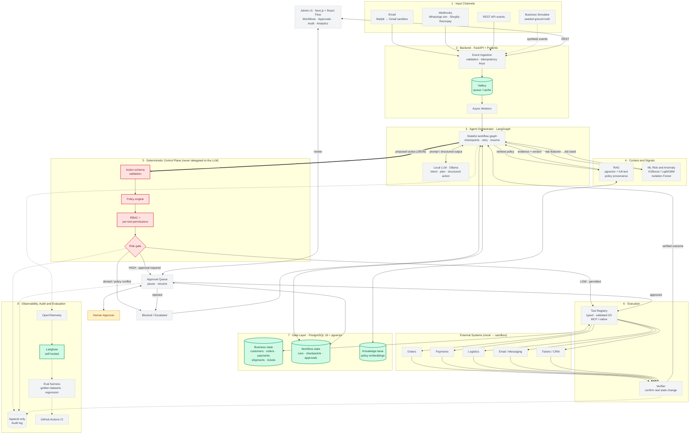
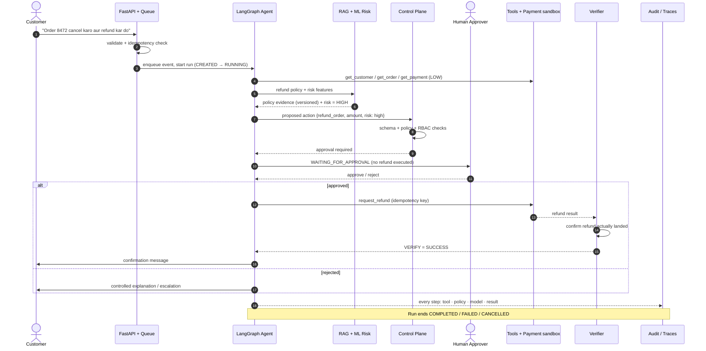
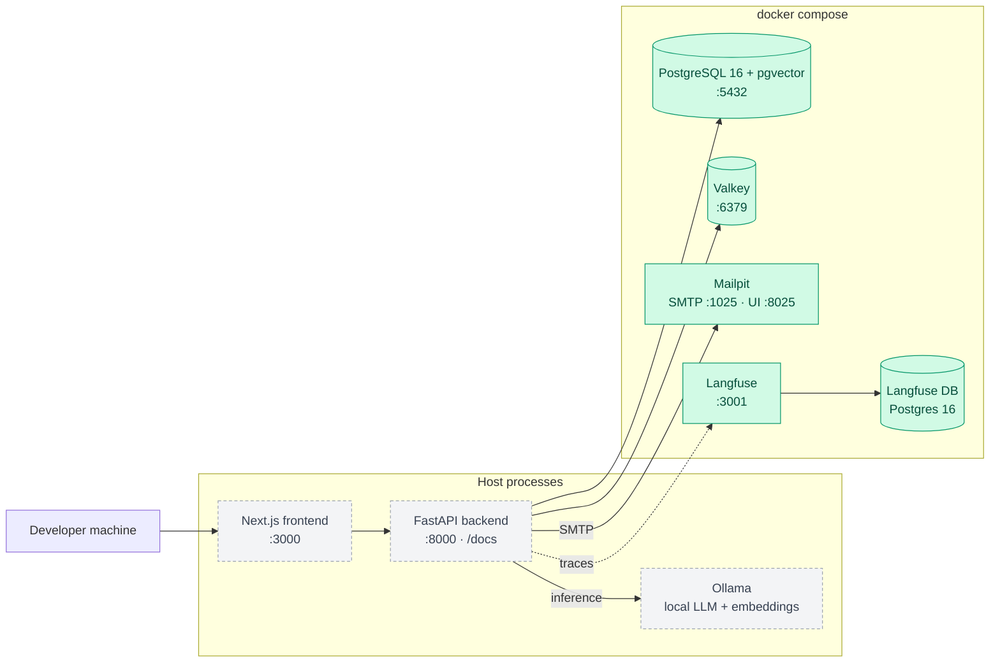

# OpsWingman

> **Intelligent Operations for Modern Businesses**  
> A local-first, agentic operations platform designed to execute repeatable business workflows across email, orders, payments, logistics, knowledge, and internal systems — while keeping policy, permissions, verification, and auditability strictly outside the LLM.

---

## 🎯 Project Overview

OpsWingman provides a reliable operations execution layer for customer and order workflows (initially targeting Indian SMB operations). Rather than acting as an unrestricted chatbot or conversational copilot, OpsWingman treats AI models as reasoning and drafting components governed by **deterministic application code**, **formal authorization boundaries**, and **human-in-the-loop review** for sensitive actions.

### 🛡️ Core Architectural Principle
> **The LLM must NOT control authorization, permissions, secrets, database truth, or final approval of sensitive actions.**  
> All security policies, financial executions, state updates, and external API requests are validated and guarded by deterministic software boundaries.

---

## 📊 Current Status: Phase 4 — ML Risk Scoring, Verification & Resilience

The repository is currently at **Phase 4 (ML Risk Scoring)**.

- [x] Monorepo directory structure established
- [x] Docker & local development environment configured
- [x] Baseline dependencies & packaging defined (FastAPI / Next.js)
- [x] Foundation architecture documentation & coding conventions documented
- [x] Unit test harness initialized
- [x] *Phase 1: Operational API & Business Simulator (Next milestone)*
- [x] *Phase 2: Workflow Engine, State & Tool Registry*
- [x] *Phase 3: RAG, Policy Engine & Human Approval Queue*
- [ ] *Phase 4: ML Risk Scoring, Verification & Resilience*
- [ ] *Phase 5: Evaluation Harness, Benchmark Datasets & E2E Verification*

---

## 🏗️ Repository Structure

```
opswingman/
├── frontend/                  # Next.js 14+ frontend with TypeScript & React Flow
├── backend/                   # Python 3.12+ FastAPI backend service
│   ├── api/                   # REST API routes & controllers
│   ├── agents/                # LangGraph stateful agent definitions
│   ├── workflows/             # Business workflow definitions & state transitions
│   ├── tools/                 # Typed tool registry & permission perimeter
│   ├── policies/              # Deterministic business rules & decision engines
│   ├── rag/                   # Knowledge retrieval, ingestion, & citation provenance
│   ├── ml/                    # Risk scoring, anomaly detection, & versioned models
│   ├── approvals/             # Human-in-the-loop approval state management
│   ├── audit/                 # Append-only audit logging & trace provenance
│   ├── security/              # Auth, input sanitization, & secret governance
│   └── evaluation/            # In-code evaluation probes & assertion monitors
├── simulator/                 # Synthetic business event & ground-truth data generator
├── workers/                   # Async task workers & background queue consumers
├── database/                  # Database models and Alembic migrations
│   ├── models/                # SQLAlchemy operational models
│   └── migrations/            # Alembic migration scripts
├── integrations/              # External service adapters & sandbox clients
│   ├── mock/                  # High-fidelity mock services
│   ├── gmail/                 # Email integration
│   ├── razorpay/              # Payment gateway integration
│   ├── shopify/               # Order management integration
│   └── whatsapp/              # Messaging channel integration
├── evals/                     # Evaluation datasets, evaluators, & regression suites
│   ├── datasets/              # Golden benchmark scenarios & ground truth
│   ├── evaluators/            # Task-specific scoring evaluators
│   ├── regression/            # Automated regression suites
│   └── reports/               # Evaluation run outputs & metric reports
├── tests/                     # Multi-tier test suite
│   ├── unit/                  # Unit tests for deterministic logic
│   ├── integration/           # Integration tests for databases & tools
│   ├── e2e/                   # Full workflow end-to-end tests
│   ├── security/              # Security perimeter & prompt injection tests
│   └── resilience/            # Failure recovery & chaos tests
├── docs/                      # Project documentation & operational guides
├── architecture/              # System architecture specifications & diagrams
├── scripts/                   # Developer automation & lifecycle scripts
├── docker/                    # Dockerfiles & container initialization scripts
├── docker-compose.yml         # Local infrastructure orchestration
└── .env.example               # Environment variables template
```
## 🏛️ System Architecture

> **Core rule:** the LLM *proposes*, deterministic code *decides*. Authorization, policy, execution, verification and audit all live outside the model.

**Legend:** 🟩 green = provisioned in Phase 0 (Docker infra) · ⬜ grey dashed = planned (Phases 1–7)



### Request lifecycle: high-value refund (Scenario A2)



### Local infrastructure (Docker Compose)




---

## 🛠️ Technology Stack

| Layer | Technologies |
| :--- | :--- |
| **Backend** | Python 3.12, FastAPI, Pydantic v2, SQLAlchemy 2.0, Alembic |
| **Frontend** | Next.js, React, TypeScript, Tailwind CSS, React Flow |
| **Database** | PostgreSQL 16 + `pgvector` extension |
| **Cache & Queue** | Valkey (Redis-compatible) |
| **Local Services** | Mailpit (SMTP capture), Ollama (Local LLM / Embeddings) |
| **Observability** | OpenTelemetry, Self-Hosted Langfuse |
| **Testing** | pytest, pytest-asyncio, Playwright |

---

## 🚀 Quick Start (Phase 0 Local Setup)

### 1. Prerequisites
- [Docker](https://docs.docker.com/get-docker/) & Docker Compose
- [Python 3.12+](https://www.python.org/)
- [Node.js 20+](https://nodejs.org/)

### 2. Configure Environment
```bash
# Copy example environment variables
cp .env.example .env
```

### 3. Start Local Infrastructure
```bash
# Start PostgreSQL (pgvector), Valkey, Mailpit, and Langfuse
docker compose up -d postgres valkey mailpit langfuse-db langfuse
```

### 4. Run Backend
```bash
# Set up Python virtual environment
python -m venv .venv
source .venv/bin/activate  # On Windows: .venv\Scripts\activate
pip install -r backend/requirements.txt

# Run FastAPI dev server
uvicorn backend.main:app --reload --port 8000
```
Backend API will be live at [http://localhost:8000](http://localhost:8000) (Interactive Swagger UI at `/docs`).

### 5. Run Frontend
```bash
cd frontend
npm install
npm run dev
```
Frontend UI will be live at [http://localhost:3000](http://localhost:3000).

### 6. Run Baseline Tests
```bash
pytest tests/unit
```

---

## 🚦 Continuous Integration & Quality Gates

Every push and pull request is automatically validated through the GitHub Actions CI pipeline (`.github/workflows/ci.yml`) against eight strict quality gates:

1. **Repository Hygiene**: `git diff --check` ensures no trailing whitespace or corrupt line-endings.
2. **Static Type Checking**: `npx pyright backend tests database simulator scripts` strictly enforces zero errors and type safety across all subsystems.
3. **Automated Test Suite**: `python -m pytest -q` executes all unit, integration, and resilience tests (301+ tests).
4. **Database Migration Consistency**: Runs `alembic upgrade head`, `alembic current`, `alembic heads`, and `alembic check` against a live PostgreSQL 16 container to verify schema synchronicity.
5. **Configuration & Security Validation**:
   - Validates development settings via `python scripts/ops.py check-config --env development`.
   - Validates that production mode (`--env production`) strictly rejects default secrets or active debug modes.
6. **Production & Staging Preflight Validation**: `python scripts/ops.py preflight` verifies 21 strict validation gates including container security, manifest health probes, staging overlay packaging, migration strategy, and secret hygiene.
7. **Production Container Build**: Builds the hardened non-root container image (`docker/Dockerfile.backend`).
8. **Container Smoke Test**: Boots the production container in isolation and verifies HTTP 200 responses from `/health` and `/health/live`.

### Reproducing CI Checks Locally

Run the following suite of commands to match the CI pipeline locally:

```bash
# 1. Format and hygiene check
git diff --check

# 2. Static typecheck
npx pyright backend tests database simulator scripts

# 3. Full test suite
python -m pytest -q

# 4. Alembic migration verification (requires local postgres)
alembic current
alembic heads
alembic check

# 5. Configuration validation
python scripts/ops.py check-config --env development

# 6. Production preflight validation
python scripts/ops.py preflight

# 7. Container packaging validation
docker build -f docker/Dockerfile.backend -t opswingman-backend:local .
```

---

## ☸️ Production Deployment (Kubernetes)

Cloud-agnostic, production-grade Kubernetes manifests are provided under [`deploy/kubernetes/`](file:///deploy/kubernetes/):

- `namespace.yaml`: Isolated `opswingman` namespace.
- `configmap.yaml`: Non-sensitive runtime configuration (`DEBUG=false`, `ENVIRONMENT=production`, CORS, logging).
- `secret.yaml`: Secrets template for `APP_SECRET_KEY`, database credentials, and external tokens.
- `deployment.yaml`: RollingUpdate Deployment (2 replicas, non-root security context, resource limits, `/health/live` liveness probe, `/health/ready` readiness probe).
- `service.yaml`: Internal `ClusterIP` Service exposing port 8000.
- `ingress.yaml`: Cloud-agnostic Ingress routing traffic to `opswingman-backend-service` with `spec.ingressClassName: nginx`.
- `migration-job.yaml`: Controlled Kubernetes Job for schema migrations (`opswingman-db-migrate`).
- `kustomization.yaml`: Kustomize composition for one-command lifecycle operations.
- `overlays/staging/`: Staging Kustomize overlay configured for isolated namespace `opswingman-staging`.

### 1. Prerequisites
- A running Kubernetes cluster (v1.26+)
- `kubectl` configured with cluster access
- Ingress controller (e.g. `ingress-nginx`, Traefik, AWS ALB Controller, or GCP GKE Ingress)
- External or separately provisioned **PostgreSQL 16 (with `pgvector`)** and **Valkey / Redis** instances

### 2. Configure Secrets
Populate [`deploy/kubernetes/secret.yaml`](file:///deploy/kubernetes/secret.yaml) with production credentials retrieved securely from your Secret Manager (e.g. HashiCorp Vault, AWS Secrets Manager, GCP Secret Manager, or GitHub Secrets):
```yaml
stringData:
  APP_SECRET_KEY: "<cryptographically-secure-key-min-32-chars-from-secret-manager>"
  DATABASE_URL: "postgresql+asyncpg://<user>:<password>@<db-host>:5432/opswingman"
  DATABASE_SYNC_URL: "postgresql://<user>:<password>@<db-host>:5432/opswingman"
```

### 3. Deploy to Cluster
Apply all manifests using Kustomize:
```bash
kubectl apply -k deploy/kubernetes/
```
*(Or apply individually: `kubectl apply -f deploy/kubernetes/`)*

### 4. Monitor Rollout & Pod Health
```bash
# Check deployment rollout
kubectl rollout status deployment/opswingman-backend -n opswingman

# Check pod status and probe health
kubectl get pods -n opswingman -l app.kubernetes.io/name=opswingman-backend
```

### 5. Verify Health Probes Locally via Port Forward
```bash
kubectl port-forward svc/opswingman-backend-service 8000:8000 -n opswingman

# Liveness probe
curl http://localhost:8000/health/live

# Readiness probe (verifies active DB connectivity)
curl http://localhost:8000/health/ready
```

### 6. Teardown
```bash
kubectl delete -k deploy/kubernetes/
```

---

## 🧪 Staging Deployment & Hardening (Kubernetes)

OpsWingman provides a dedicated Kustomize staging overlay under [`deploy/kubernetes/overlays/staging/`](file:///deploy/kubernetes/overlays/staging/) designed for pre-production integration testing in an isolated namespace.

### 1. Staging Architecture & Environment Separation
- **Isolated Namespace**: Runs in `opswingman-staging` (ensures zero resource collision with production).
- **Environment**: Sets `ENVIRONMENT=staging` with interactive OpenAPI documentation enabled (`DOCS_ENABLED=true`).
- **CORS Configuration**: Restricts browser origins to `["https://staging.opswingman.io"]`.
- **Modern Ingress**: Configures standard `spec.ingressClassName: nginx` targeting host `api-staging.opswingman.example.com`.
- **TLS Provisioning**: Add a `tls:` block to [`deploy/kubernetes/overlays/staging/ingress-patch.yaml`](file:///deploy/kubernetes/overlays/staging/ingress-patch.yaml) or attach `cert-manager.io/cluster-issuer: letsencrypt-staging` annotation once cluster certificates are provisioned.

### 2. Migration Concurrency Resolution
- **Multi-Replica Safety**: In multi-replica Kubernetes environments, `AUTO_MIGRATE` is set to `"false"` in `configmap.yaml` to prevent concurrent startup race conditions.
- **Controlled Migration Job**: Schema migrations are executed once via the dedicated Kubernetes Job [`deploy/kubernetes/migration-job.yaml`](file:///deploy/kubernetes/migration-job.yaml) or via `python scripts/ops.py migrate` before rollout.
- **Schema Readiness Polling**: Pods enforce `WAIT_FOR_MIGRATION="true"`, waiting for database schema readiness at Alembic head via `python scripts/ops.py check-migration-ready --timeout 60` before booting the API process.
- **Local Dev Preserved**: Local single-container development (`docker-compose.yml`) defaults to `AUTO_MIGRATE=true` for zero-friction iteration.
- **Migration & Rollback Implications**:
  - Migrations must follow the expand/contract pattern and remain backwards-compatible with running pods.
  - Rolling back application pods (`kubectl rollout undo`) reverts container binaries but does not down-migrate the database. If a migration added a column or index, the previous application version continues to operate safely against the expanded schema.
  - Destructive schema rollbacks require planned maintenance and running `alembic downgrade <target_rev>`.

### 3. Staging Deployment Sequence

#### Manual Deployment via Kustomize
```bash
# 1. Ensure staging namespace exists
kubectl create namespace opswingman-staging --dry-run=client -o yaml | kubectl apply -f -

# 2. Inject staging secrets securely from environment or secret manager (never hardcode in files)
# Generate a cryptographically secure staging secret key:
# STAGING_APP_SECRET_KEY=$(openssl rand -hex 32)
# Load database credentials from your secure secret store (e.g. Vault, AWS Secrets Manager, 1Password):
kubectl create secret generic opswingman-backend-secrets \
  --namespace opswingman-staging \
  --from-literal=APP_SECRET_KEY="${STAGING_APP_SECRET_KEY:?STAGING_APP_SECRET_KEY must be set}" \
  --from-literal=DATABASE_URL="${STAGING_DATABASE_URL:?STAGING_DATABASE_URL must be set}" \
  --from-literal=DATABASE_SYNC_URL="${STAGING_DATABASE_SYNC_URL:?STAGING_DATABASE_SYNC_URL must be set}" \
  --dry-run=client -o yaml | kubectl apply -f -

# 3. Define target immutable image (exact same image for migration and deployment)
export STAGING_IMAGE="ghcr.io/<org>/opswingman-backend:sha-$(git rev-parse --short HEAD)"

# 4. Run schema migration job with the EXACT target image before deploying application
kubectl delete job opswingman-db-migrate -n opswingman-staging --ignore-not-found
python -c "
import yaml
with open('deploy/kubernetes/migration-job.yaml') as f:
    j = yaml.safe_load(f)
j['spec']['template']['spec']['containers'][0]['image'] = '$STAGING_IMAGE'
with open('deploy/kubernetes/migration-job.yaml', 'w') as f:
    yaml.dump(j, f)
"
kubectl apply -f deploy/kubernetes/migration-job.yaml -n opswingman-staging
kubectl wait --for=condition=complete job/opswingman-db-migrate -n opswingman-staging --timeout=180s

# 5. Apply staging Kustomize overlay with image override
python -c "
import yaml
with open('deploy/kubernetes/overlays/staging/kustomization.yaml') as f:
    k = yaml.safe_load(f)
repo, tag = '$STAGING_IMAGE'.rsplit(':', 1)
k['images'][0]['newName'] = repo
k['images'][0]['newTag'] = tag
with open('deploy/kubernetes/overlays/staging/kustomization.yaml', 'w') as f:
    yaml.dump(k, f)
"
kubectl apply -k deploy/kubernetes/overlays/staging/

# 6. Monitor rollout status
kubectl rollout status deployment/opswingman-backend -n opswingman-staging --timeout=300s
```

#### Automated Deployment via GitHub Actions
A dedicated staging workflow is provided at [`.github/workflows/deploy-staging.yml`](file:///.github/workflows/deploy-staging.yml):
- Triggered manually via **Actions** -> **Staging Deployment** (`workflow_dispatch`).
- Gated by GitHub Environment `staging`.
- Deploys immutable SHA container tags without triggering production deployment.
- Executes the migration job prior to updating deployment pods.

### 4. Health Verification & Rollback
```bash
# Verify pod and probe health
kubectl get pods -n opswingman-staging -l app.kubernetes.io/name=opswingman-backend

# Port-forward to query endpoints
kubectl port-forward svc/opswingman-backend-service 8000:8000 -n opswingman-staging
curl -s http://localhost:8000/health/live
curl -s http://localhost:8000/health/ready
curl -s http://localhost:8000/risk/model-info

# Emergency rollback
kubectl rollout history deployment/opswingman-backend -n opswingman-staging
kubectl rollout undo deployment/opswingman-backend -n opswingman-staging
kubectl rollout status deployment/opswingman-backend -n opswingman-staging
```

---

## 🚀 Production Image Release & Deployment

OpsWingman utilizes a provider-neutral GitHub Actions release workflow (`.github/workflows/release.yml`) for container image publishing and automated Kubernetes rolling updates.

### 1. Required GitHub Configuration

#### Repository Variables (`Settings -> Secrets and variables -> Actions -> Variables`)
- `REGISTRY`: Target container registry hostname (e.g. `ghcr.io`, `docker.io`, `<account_id>.dkr.ecr.<region>.amazonaws.com`). Defaults to `ghcr.io`.
- `IMAGE_NAME`: Repository image namespace/path (e.g. `myorg/opswingman-backend`). Defaults to the GitHub repository name.

#### Repository Secrets (`Settings -> Secrets and variables -> Actions -> Secrets`)
- `REGISTRY_USERNAME`: Username or robot account with container push permissions.
- `REGISTRY_PASSWORD`: Access token, personal access token (PAT), or password.
- `KUBECONFIG`: (Optional) Base64 or plaintext kubeconfig containing cluster credentials for continuous delivery.

### 2. How to Perform a Release

#### Method A: Git Version Tagging (Recommended)
Tagging a commit on `main` triggers image building, tagging, and deployment:
```bash
git tag v0.1.0
git push origin v0.1.0
```

#### Method B: Manual Workflow Dispatch
1. Navigate to **Actions** -> **Production Release & Deployment**.
2. Click **Run workflow**.
3. Optionally specify a custom `image_tag` or enable `deploy_to_k8s: true`.

### 3. Image Naming & Tagging Strategy
Every build generates immutable OCI tags to prevent accidental overwrites:
- **Immutable Git SHA**: `<REGISTRY>/<IMAGE_NAME>:sha-<SHORT_SHA>` (e.g., `ghcr.io/myorg/opswingman-backend:sha-7b3e1a0`)
- **Release Version**: `<REGISTRY>/<IMAGE_NAME>:v0.1.0` (when triggered via version tag)
- **Latest**: `<REGISTRY>/<IMAGE_NAME>:latest` (only on semantic version tags)

All images include standard OCI provenance labels (`org.opencontainers.image.revision`, `org.opencontainers.image.version`, `org.opencontainers.image.source`).

### 4. Production Approval & Security Controls
- **GitHub Environment Protection**: The `deploy-production` job is bound to the `production` environment. Production deployments require required reviewer approval before executing.
- **Pull Request Isolation**: The release and deployment workflow cannot be triggered by pull requests (`pull_request` events are explicitly excluded).
- **Dry-Run Validation Gate**: Manifests are automatically validated with `scripts/ops.py validate-release` and `kubectl kustomize` before any container build starts.

### 5. Kubernetes Dry Run & Manual Deployment

#### Validate Manifests Locally
```bash
# Validate release readiness
python scripts/ops.py validate-release

# Preview rendered manifests
kubectl kustomize deploy/kubernetes/
```

#### Deploy a Specific Immutable Image
```bash
# Set deployment to a specific immutable tag
kubectl set image deployment/opswingman-backend backend=ghcr.io/myorg/opswingman-backend:sha-7b3e1a0 -n opswingman

# Monitor rolling update progress
kubectl rollout status deployment/opswingman-backend -n opswingman --timeout=300s
```

### 6. Emergency Rollback Procedure
If an issue occurs after deploying to production, execute a zero-downtime rolling rollback:
```bash
# 1. View previous rollout revisions
kubectl rollout history deployment/opswingman-backend -n opswingman

# 2. Undo deployment to previous stable revision
kubectl rollout undo deployment/opswingman-backend -n opswingman

# 3. Monitor rollback progress until healthy
kubectl rollout status deployment/opswingman-backend -n opswingman
```

---

## 📋 Production Deployment Checklist & Preflight Verification

Before initiating a production rollout to real infrastructure, verify the following three operational pillars:

### 1. Infrastructure Requirements
- [ ] **PostgreSQL 16**: Live database instance with `pgvector` extension enabled.
- [ ] **Valkey / Redis**: High-availability key-value cache and async queue instance.
- [ ] **Kubernetes Cluster**: Production Kubernetes cluster (v1.26+) accessible via kubectl.
- [ ] **Ingress Controller**: Active ingress controller (e.g. `ingress-nginx`, Traefik, AWS ALB).
- [ ] **DNS & TLS**: Public/private DNS records pointing to the ingress controller with valid TLS certificates.
- [ ] **Container Registry**: Authenticated OCI container registry (GHCR, ECR, GCR, Docker Hub).

### 2. Secrets Provisioning
- [ ] `APP_SECRET_KEY`: Cryptographically secure secret key (min 16 characters).
- [ ] `DATABASE_URL`: Connection string for async SQLAlchemy (`postgresql+asyncpg://...`).
- [ ] `DATABASE_SYNC_URL`: Connection string for sync Alembic migrations (`postgresql://...`).
- [ ] `REGISTRY_USERNAME` & `REGISTRY_PASSWORD`: CI/CD robot credentials for container publishing.
- [ ] `KUBECONFIG`: Cluster deployment authentication secret in GitHub Secrets.
- [ ] `LANGFUSE_PUBLIC_KEY` & `LANGFUSE_SECRET_KEY`: (Optional) Telemetry credentials if tracing is active.

### 3. Deployment & Verification Execution
1. **Run Production Preflight**:
   ```bash
   python scripts/ops.py preflight
   ```
   Ensures 0 `FAIL` items across manifests, security contexts, probes, and secret hygiene.
2. **Build and Tag Production Container**:
   Build immutable image tagged with Git SHA (`sha-<SHORT_SHA>`) and semantic release tag (`vX.Y.Z`).
3. **Publish to Registry**:
   Push immutable image to container registry.
4. **Approve Production Environment**:
   Approve deployment via GitHub Actions Environment reviewer gate.
5. **Apply Kustomize Manifests**:
   Deploy updated image via `kubectl apply -k deploy/kubernetes/`.
6. **Verify Rolling Rollout**:
   `kubectl rollout status deployment/opswingman-backend -n opswingman --timeout=300s`
7. **Verify Post-Deployment Endpoints**:
   - `GET /health/live` -> 200 `{"status": "alive"}`
   - `GET /health/ready` -> 200 `{"status": "ready", "services": {"api": "ok", "database": "ok"}}`
   - `GET /risk/model-info` -> 200 (Model metadata and operational risk features)
8. **Verify Container Logs**:
   `kubectl logs -n opswingman -l app.kubernetes.io/name=opswingman-backend --tail=100`
9. **Emergency Rollback Ready**:
   Confirm ability to execute `kubectl rollout undo deployment/opswingman-backend -n opswingman`.

---

## 📚 Documentation Links
- [Architecture Foundation](file:///architecture/foundation.md)
- [Local Development Guide](file:///docs/development.md)
- [Coding & Security Conventions](file:///docs/conventions.md)
- [Master Blueprint Document](file:///OpsWingman_Project_Master_Blueprint.docx)

---

## 📄 License
This project is licensed under the Apache 2.0 License.
